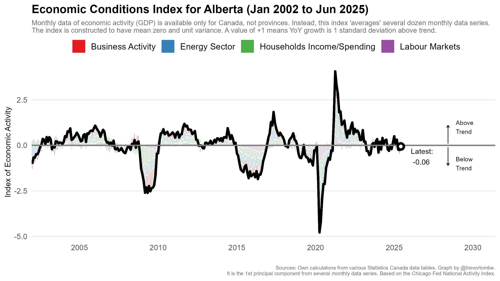

# Constructs Monthly Index of Economic Conditions in Alberta

The following compiles monthly data from a variety of courses to
estimate real-time economic conditions in Alberta. It closely follows,
as much as the data allows, the Chicago Fed National Activity Index.
<https://www.chicagofed.org/publications/cfnai/index>

There are three R files necessary to construct the Economic Conditions
Index. First “core.R” loads packages, functions, themes, and other
useful objects. Second, “ECI\_data.R” downloads the processes the
necessary data from various sources. Note that depending on the day this
file is run, manual entry of data may be required (for example, wells
drilled). Third, “ECI.R” estimates the first principle component from
this data and generates the visualization.

The latest ECI for Jun 2025 is -0.06. The full time series since Jan
2002 is plotted below:

<figure>

<figcaption aria-hidden="true">Alberta ECI</figcaption>
</figure>

------------------------------------------------------------------------

The index was last updated on 2025-09-18 14:37:29.836425 MDT.
